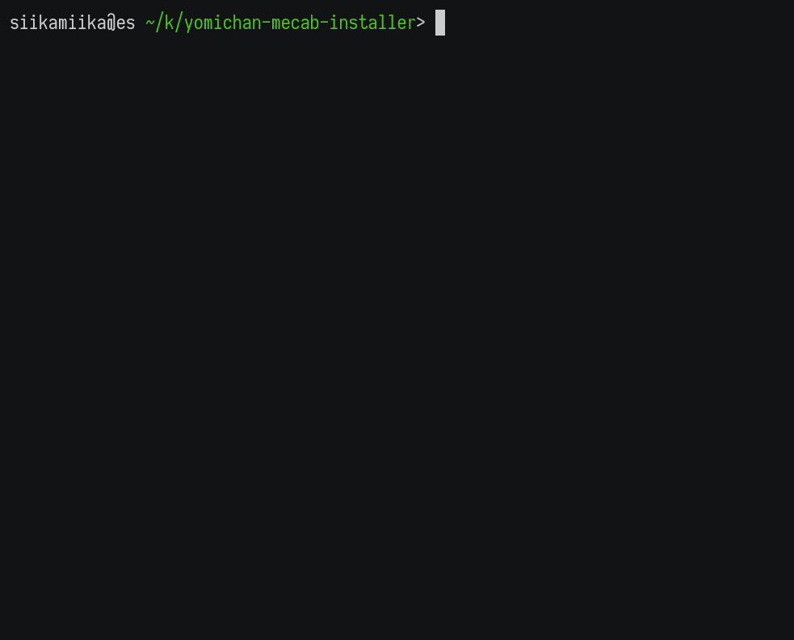

# Yomichan MeCab Installer

Installs the files required to run [MeCab](https://taku910.github.io/mecab/) in [Yomichan](https://foosoft.net/projects/yomichan/).
Python and MeCab have to be installed separately.

## Installation

If you are running Mac, first install [Homebrew](https://brew.sh/), as it is used to install the dependencies.

1. Install Python 2 or 3
    - **Windows**: https://www.python.org/downloads/
    - **Mac**: Python 2 is deprecated and will be removed in 10.16. To install Python 3, run `brew install python3`
    - **Linux**: Python is usually included with a Linux distribution
1. If you aren't using Windows, install MeCab separately
    - **Mac**: run `brew install mecab`
    - **Linux**: package managers usually include MeCab. You don't need to install a dictionary package from the package manager, this script downloads the required dictionaries for you
1. [Download](https://github.com/siikamiika/yomichan-mecab-installer/archive/master.zip) and extract this repository
to the location where you wish to install the files. `~/Downloads` might not be the best place
1. Run `install_mecab_for_yomichan.py` and follow the instructions

You can move the install directory later, but you have to run the install again if you do that.
